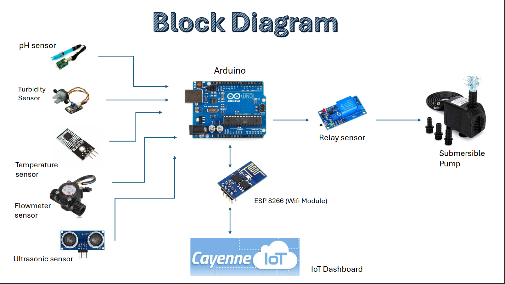
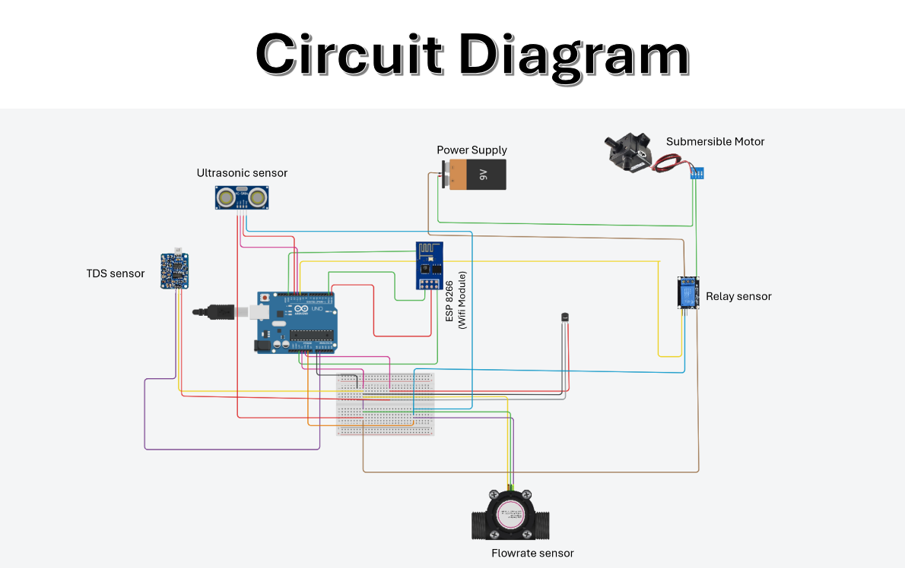
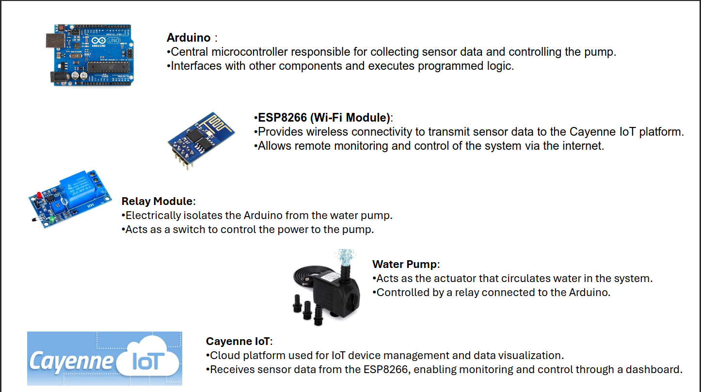
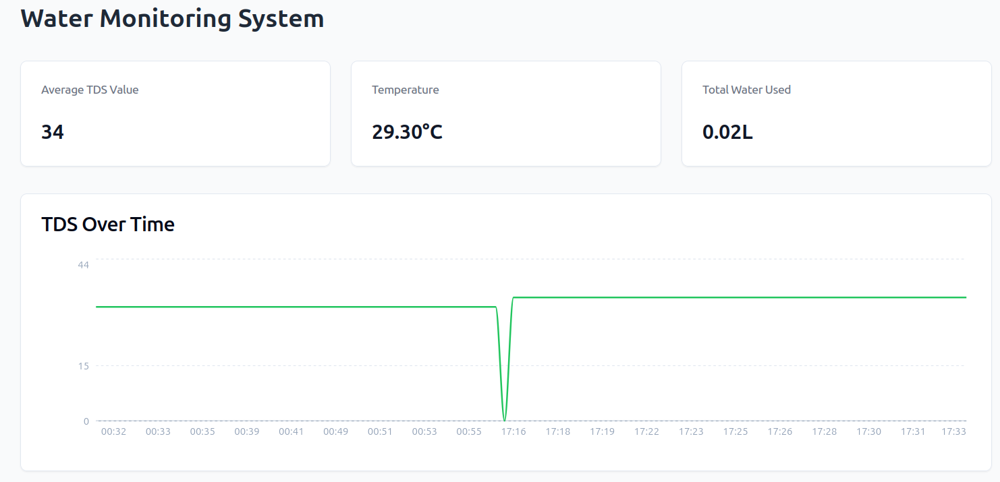
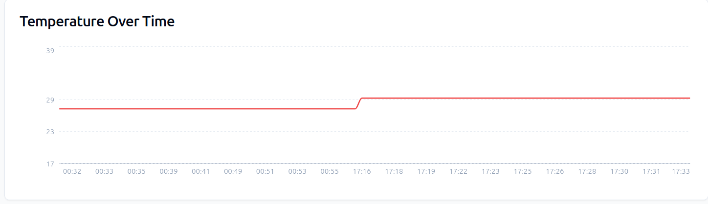

Here’s a complete and professional `README.md` file for your **Smart Water Management System using IoT** project:

---

# 💧 Smart Water Management System using IoT

This project is an **IoT-based Smart Water Management System** designed to monitor and manage household or agricultural water usage efficiently. It uses a combination of sensors and microcontrollers to measure various water parameters like **TDS (Total Dissolved Solids)**, **water temperature**, and **flow rate**, while also tracking water levels using an **ultrasonic sensor**. The collected data is then sent to **ThingSpeak** for real-time monitoring and analysis.

---

## 📁 Project Structure

```
.
├── arduinofinal.ino        # Arduino code for sensor integration
├── espfinal.ino            # ESP8266 code to send data to ThingSpeak
├── FINAL.ino               # Consolidated code with optimization
├── finallll.ino            # Final working prototype code
├── flow.ino                # Flow rate sensor code
├── smart1.ino              # Smart water control logic
├── tds.ino                 # TDS sensor reading code
├── tempesp.ino             # Temperature sensing via ESP8266
├── Block_Diagram.png       # System-level block diagram
├── ckt_diagram.png         # Complete circuit schematic
├── Drscription1.png        # Hardware description part 1
├── Discription2.png        # Hardware description part 2
├── Final .png              # Final prototype image
├── Readings.png            # Sample sensor readings
├── Total_water_usage.png   # Graph showing total water usage
└── README.md               # You are here!
```

---

## 🔧 Components Used

* **Microcontrollers:**

  * Arduino Uno
  * ESP8266 Wi-Fi Module
* **Sensors:**

  * Ultrasonic Sensor (for water level)
  * TDS Sensor (for water quality)
  * Temperature Sensor (e.g., DS18B20)
  * Flow Sensor (e.g., YF-S201)
* **Power Supply**
* **Jumpers, Breadboard, PCB (optional)**

---

## 📡 Features

* 🌊 **Water Level Monitoring** using an ultrasonic sensor.
* 📈 **Flow Rate Calculation** to estimate real-time water usage.
* 🌡️ **Water Temperature Monitoring** for system health and utility use.
* 💧 **TDS Measurement** to monitor water quality.
* ☁️ **Cloud Integration with ThingSpeak** for live monitoring and data visualization.
* 🔔 Optional: Smart alerts based on thresholds (can be integrated via IFTTT or Blynk).

---

## 🌐 IoT Integration

* Data is transmitted to **ThingSpeak** using the **ESP8266** module.
* Data fields include:

  * Temperature
  * TDS level
  * Water Flow Rate
  * (Optional) Total water consumed

---

## 🛠️ Working Principle

1. Arduino collects data from all sensors.
2. Sends the data via serial to the ESP8266.
3. ESP8266 connects to Wi-Fi and uploads data to ThingSpeak.
4. ThingSpeak stores and visualizes the data in real-time.

---

## 🖼️ Images & Diagrams

| Block Diagram                         | Circuit Diagram                       |
| ------------------------------------- | ------------------------------------- |
|  |  |

| System Description                                                        | Final Setup              |
| ------------------------------------------------------------------------- | ------------------------ |
|  |
|  | 


| |

| Readings                    | Water Usage                             |
| --------------------------- | --------------------------------------- |
|  |  |

---

## 🚀 How to Use

1. Flash `finallll.ino` to **Arduino Uno**.
2. Flash `espfinal.ino` to **ESP8266** (NodeMCU or ESP-01).
3. Connect sensors as per the circuit diagram.
4. Connect to Wi-Fi and observe data on [ThingSpeak](https://thingspeak.com/).
5. Analyze the live data graphs for water usage and quality.

---